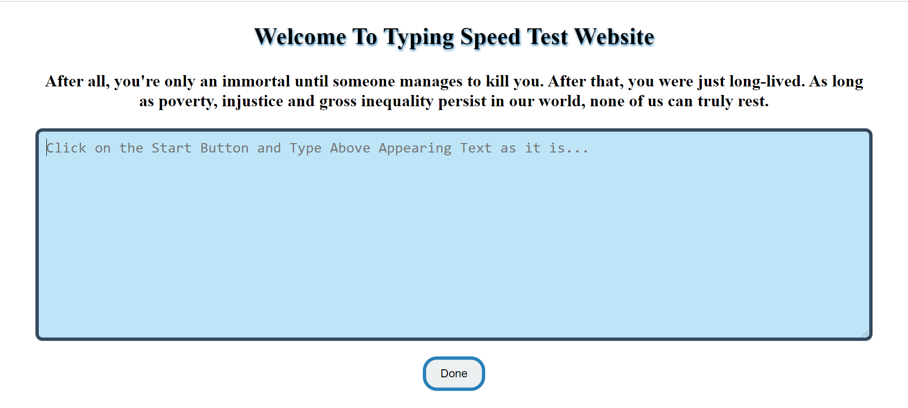

# Typing Speed Test Website

## Description
This website allows users to measure their typing speed. It provides detailed information on the time taken, in seconds, to type a specific sentence

## Use of the Project
User can improve his/her typing speed. 

## How to use the project
1. Move inside Typing Master Webite folder, use this command, `cd Type-Master`
2. Open the index.html file and run with live server.
3. Click on the start button.
4. A sentence appear on the screen, write that sentence in the empty space. 
5. After writing the complete sentence, click on Done.
6. You will get your result, how many words are typed and how much time required to type those words.

## Stacks Used
* HTML & CSS
* JavaScript

## ScreenShot

After Clicking on the Start button, UI looks like:

After clicking on the Done Button, it give the result:

## Live Demo

